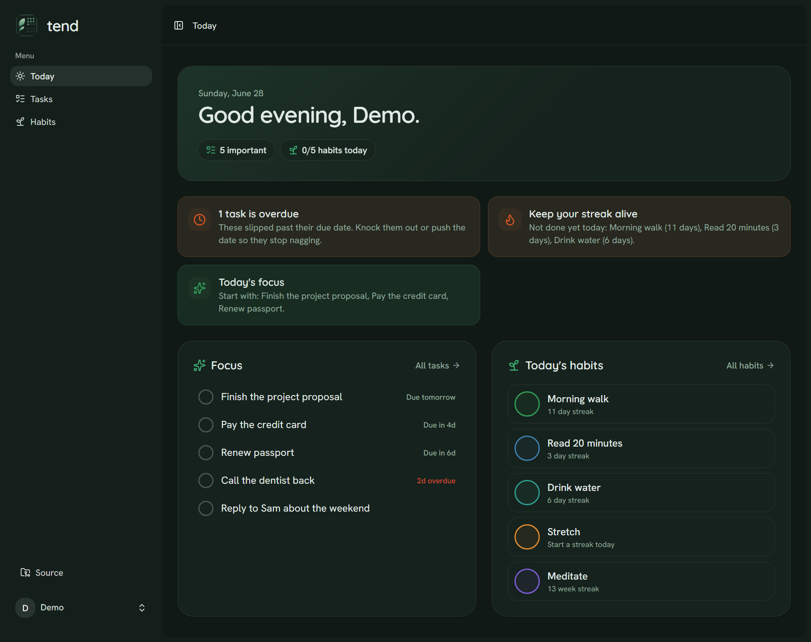
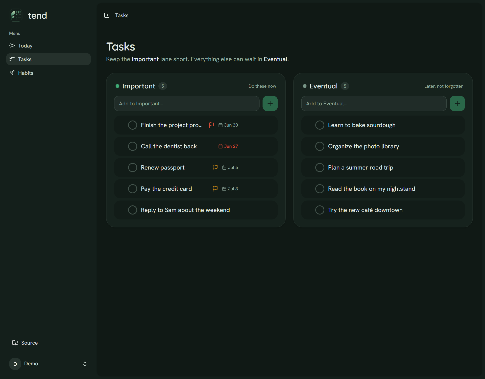
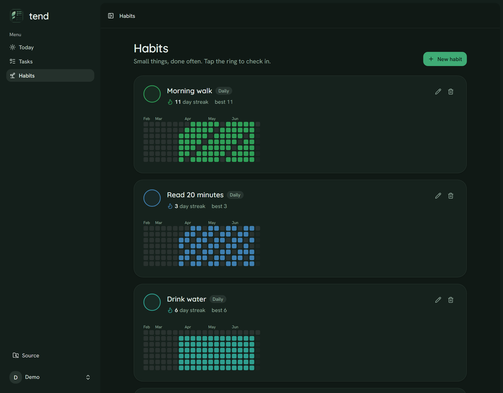
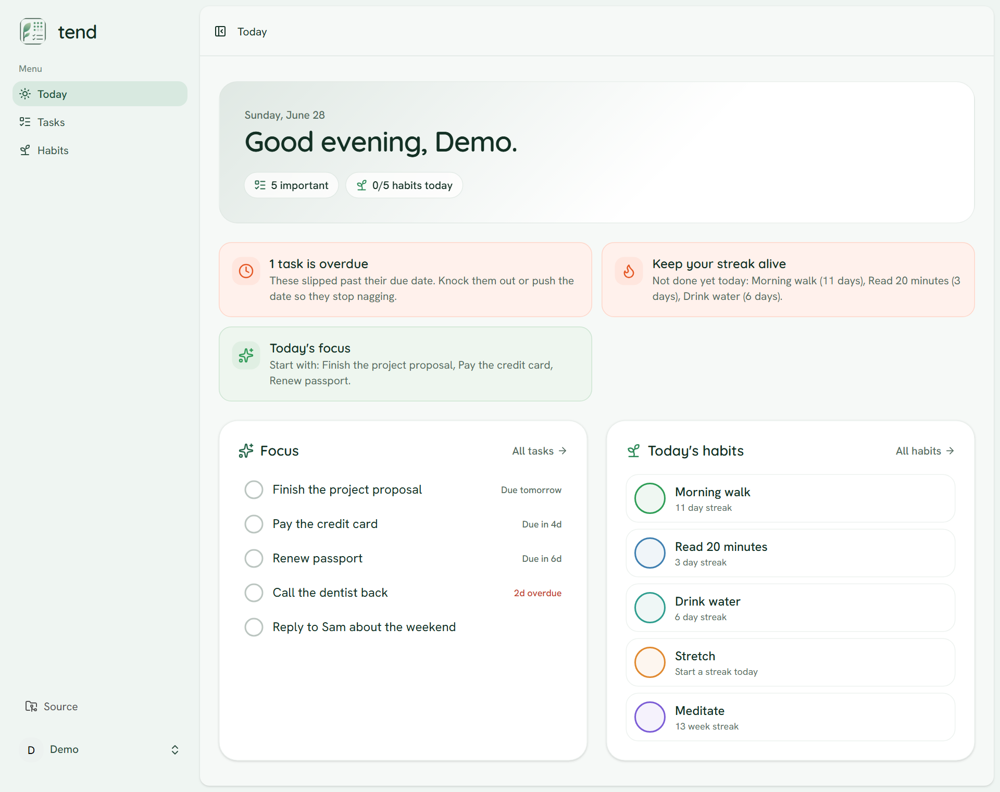

<p align="center">
  <picture>
    <source media="(prefers-color-scheme: dark)" srcset="public/tend-logo-dark.png">
    
  </picture>
</p>

<h1 align="center">Tend</h1>

<p align="center">
  A personal task and habit manager that keeps a long to-do list from getting overwhelming.<br>
  Tasks sort into two intent-based lanes, habits build streaks, and a lightweight insights
  panel nudges you toward what matters today.
</p>

<p align="center">
  Built with Laravel + Inertia + Vue, with a clean, Splitwise-inspired interface.
</p>

## Features

- **Two-lane tasks** — separate **Important** (act now) from **Eventual** (later)
  so the "do now" set stays small and honest.
- **Habit tracker** — daily and weekly habits with one-tap check-off, current and
  longest streaks, and a contribution-style calendar grid.
- **Insights** — a small, deterministic engine that flags overdue work, an
  overloaded Important lane, at-risk streaks, and a suggested focus for the day.
- **Self-hostable** — multi-user auth out of the box (login, registration,
  password reset, 2FA, passkeys).

## 📸 Screenshots

> Screenshots are auto-generated from the seeded demo account by the
> [screenshots](.github/workflows/screenshots.yml) workflow.

<p align="center">
  
</p>

<p align="center">
  
</p>

<p align="center">
  
</p>

<p align="center">
  
</p>

## Hosting

Tend is free and open source — self-host it anywhere PHP and Postgres run.

Prefer not to run a server? A managed, always-up hosted option is in the works
for a small monthly fee, as a convenience alternative to self-hosting. (Link
coming soon.)

## Tech stack

- Laravel 13 (PHP 8.4+)
- Inertia 2 + Vue 3 (TypeScript)
- Tailwind CSS 4 + Vite
- PostgreSQL (Docker for local dev)
- Pest 4, Pint, PHPStan/Larastan

## Local development

Requirements: PHP 8.4+, Composer, Node 20+, Docker.

```bash
# 1. Install dependencies
composer install
npm install

# 2. Start Postgres (Docker)
docker compose up -d

# 3. Set up the app
cp .env.example .env
php artisan key:generate
php artisan migrate

# 4. Run the app (server + queue + Vite)
composer dev
```

The app runs at http://localhost:8000. Postgres is published on host port
`55435` (configurable via `FORWARD_DB_PORT`). The app and Vite run on the host;
only the database lives in Docker.

### Tests

```bash
php artisan test          # Pest, in-memory SQLite
./vendor/bin/pint --test  # code style
./vendor/bin/phpstan analyse --memory-limit=1G
```

## License

MIT
